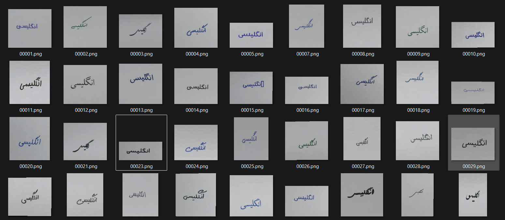

# Handwriting-Wikipedia-Dataset-Generator
A wikipedia based Handwriting dataset generator, coded with python. A high-quality, curated dataset featuring words and sentences that are highly natural and closely resemble human handwriting.

==========================================


یک ابزار تولید مجموعه داده دست‌خط مبتنی بر ویکی‌پدیا که با زبان پایتون برنامه‌نویسی شده است. این مجموعه داده باکیفیت و گزینش‌شده، شامل کلمات و جملاتی است که بسیار طبیعی بوده و شباهت زیادی به دست‌خط انسان دارند.

 ## عدم وابستگی ها:
 - به زبان وابسته نیست! می تواند روی هر زبانی کار کند
 - نیاز به هیچ اطلاعاتی نیست! خودش اطلاعات را استخراج و پوشه بندی می کند
 - ساختار یافته است! خروجی دیتسات کاملا ساتار یافته می باشد
 - قابلیت اضافه کردن داده های شکلی و عددی را خودکار دارد
 - نیاز به کارت گرافیک ندارد و بسیار بسیار سریع است!





   
## نصب وابستگی‌ها:
```
pip install requests pillow numpy arabic-reshaper python-bidi fonttools


    (arabic-reshaper و python-bidi فقط برای زبان‌های راست‌به‌چپ مانند فارسی لازم‌اند)
    (fonttools اختیاری اما به‌شدت توصیه‌شده: بررسی دقیق پشتیبانی فونت از حروف،
     تا از تولید تصاویر «مربع‌مربع/Tofu» جلوگیری شود)
```

## ساختار پوشه‌ها (کنار همین فایل):
```
    Base_Handwrite_Font/      ← فونت‌های دست‌خط (ttf/otf) - خودکار شناسایی می‌شوند
    Base_Handwrite_BGpaper/   ← تصاویر کاغذ (png/jpg) - پس‌زمینه تصادفی
    handwrite_dataset/        ← خروجی (خودکار ساخته می‌شود)
 ```
## نکته:
اکنون در Base_Handwrite_Font تعدای فونت وجود دارد که مخصوص فارسی هستند عموما. برای زبان یا زبان های هدف فونت های مناسب جایگزین کنید
و در Base_Handwrite_BGpaper تعدادی پس زمینه یا همان کاغذ وجود دارد. الزامی به تعویض نیست ولی می توان آن را با داده خود جایگزین یا اضافه کنید

## نمونه اجرا:
```    
python Handwriting_Wikipedia_Dataset_Generator.py \
        --lang fa --keywords "سلول خورشیدی" "پروسکایت" فیزیک \
        --max-unique-words 50000 --window 1 --stride 1 \
        --samples-per-class 20 --workers 8 --metadata
 ```
## پارامترهای اصلی:
```    
پارامترهای اصلی:
    --lang               کد زبان ویکی‌پدیا (fa, en, de, ...)          [پیش‌فرض: fa]
    --keywords           یک یا چند کلیدواژه اولیه برای شروع جستجو      [اجباری]
    --max-unique-words   حداقل تعداد واژه/عبارت یکتای موردنیاز          [پیش‌فرض: 50000]
    --window             تعداد کلمات هر تصویر (Sliding Window)         [پیش‌فرض: 1]
    --stride             گام پنجره لغزان                               [پیش‌فرض: 1]
    --samples-per-class  تعداد نمونه تصویر برای هر کلاس                [پیش‌فرض: 10]
    --min-word-len       حداقل طول واژه معتبر                          [پیش‌فرض: 2]
    --workers            تعداد پردازش‌های موازی (0 = تعداد هسته‌ها)     [پیش‌فرض: 0]
    --phash-threshold    آستانه فاصله همینگ برای حذف تصاویر مشابه       [پیش‌فرض: 4]
    --metadata           ذخیره فایل JSON اطلاعات کنار هر تصویر
    --numbers            افزودن ارقام 0 تا 9 به کلاس‌های دیتاست
                         (برای زبان‌های راست‌به‌چپ، ارقام فارسی ۰ تا ۹ نیز اضافه می‌شود)
    --shape              افزودن بیش از ۲۰ شکل پرکاربرد ریاضی (دایره، مثلث، مربع، ...)
                         به‌صورت دست‌کشیده؛ نام پوشه این کلاس‌ها پسوند __SHAPE دارد
    --fonts-dir / --bg-dir / --output-dir   مسیرهای سفارشی

 ```

نکته: هر فونت قبل از استفاده بررسی می‌شود که تمام حروفِ متن را پشتیبانی کند؛
در غیر این صورت فونت دیگری انتخاب می‌شود تا خروجی خراب (Tofu/□□□) ساخته نشود.

قابلیت ادامه (Resume): اجرای مجدد فقط نمونه‌های باقی‌مانده را تولید می‌کند و
واژه‌های جمع‌آوری‌شده در فایل state ذخیره می‌شوند تا دوباره از ویکی‌پدیا دریافت نشون
کد اصلی توسط هوش مصنوعی بهینه شده است!
